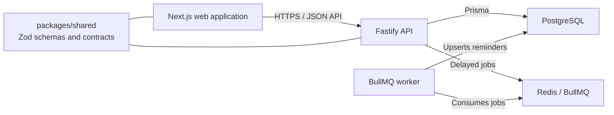
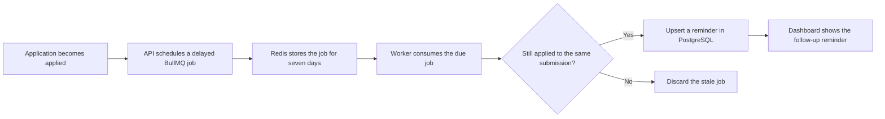

# Architecture and engineering decisions

## System overview

The project is a pnpm monorepo with independently deployed web, API, and worker processes.
The web application and API share TypeScript contracts and Zod schemas through
`packages/shared`, but they do not share runtime code.



## Backend structure

```text
apps/api/src/
├── config/    Environment parsing and validation
├── db/        Prisma client and database helpers
├── lib/       Cross-cutting utilities, logging, and errors
├── plugins/   Fastify plugins for dependency injection and error handling
└── modules/   Domain modules split into routes, services, and repositories
```

Each domain module is split by responsibility rather than file type.

| Layer      | Responsibility                                   | Knows about                    |
| ---------- | ------------------------------------------------ | ------------------------------ |
| Route      | HTTP parsing, status codes, and headers          | Fastify and services           |
| Service    | Business rules, orchestration, and authorization | Repositories and domain errors |
| Repository | Data access and query construction               | Prisma only                    |

The dependency direction is intentional:

- Services never receive `request` or `reply`, which keeps them independent of HTTP.
- Repositories do not throw HTTP-aware errors; they return data or `null`.
- Routes contain HTTP concerns only. Business logic belongs in services.

Factory functions provide lightweight dependency injection without a container. For example,
`createHealthService(prisma)` accepts its dependency directly, which makes tests and lifecycle
management straightforward.

## API platform and operational safeguards

Fastify provides TypeScript support, plugin encapsulation, structured Pino logging, and
schema-based serialization. The application adds several cross-cutting safeguards:

- **Fail-fast configuration.** Zod validates API configuration at startup; workers use the same
  validated database configuration. A malformed deployment fails before it accepts traffic.
- **Uniform error contract.** Domain errors, Zod validation failures, and known Prisma errors are
  mapped to one response shape with a request ID.
- **Request correlation.** The API reuses an inbound `x-request-id` or generates one, includes it
  in log entries, and returns it in responses.
- **Log redaction.** Authorization and cookie headers, `set-cookie`, passwords, and password
  hashes are redacted before reaching log storage.
- **Health checks.** `/healthz` is a liveness check; `/readyz` checks PostgreSQL and returns 503
  when the dependency is unavailable.
- **Security and documentation.** Helmet, an exact CORS allowlist, rate limits, and public
  Swagger UI are configured in the API application. See the
  [production deployment guide](production-deployment.md) for the operational configuration.

`buildApp()` builds a configured Fastify instance without binding a port. `index.ts` owns
listening and signal handling, so integration tests can run the real API in-process through
`app.inject()`.

## Background jobs and reminders

When an application enters the `applied` status, the API schedules one BullMQ job delayed by
seven days. The separate worker owns processing of due jobs.



The deterministic job ID `follow-up-{applicationId}` ensures that an application has at most one
waiting follow-up job. Moving away from `applied` removes the job. Each job also carries the
exact `appliedAt` timestamp, which the worker compares before writing a reminder; this prevents
an earlier application cycle from creating a reminder after the user reapplies.

The `reminders` table is unique on `(applicationId, type, applicationAppliedAt)`. Since BullMQ
may retry a job, the worker uses an upsert to make processing idempotent. The dashboard lists
unread reminders, and users can mark an owned reminder as read.

Redis uses AOF persistence and `maxmemory-policy noeviction` locally, preventing BullMQ keys
from being evicted under memory pressure. The worker drains active jobs and disconnects Prisma
cleanly during shutdown.

### Reliability boundary

Updating PostgreSQL and adding a Redis job are separate writes. A Redis outage immediately after
the database update can leave an application in `applied` without a queued job, even if the
request reports an error. The next reliability improvement is a transactional outbox: write a
follow-up event in the same PostgreSQL transaction, relay pending events to BullMQ with retries,
and mark them published only after Redis accepts them.

## Data access trade-offs

The application makes two deliberate choices for the expected scale of hundreds, rather than
millions, of applications per user.

### Offset pagination

The application list uses `skip` and `take`, with a parallel `count()` in one transaction so the
page and total remain consistent. Offset pagination becomes more expensive at deep pages and can
shift rows when records are inserted concurrently. Keyset pagination would avoid both issues,
but it cannot easily support arbitrary user-selected sorting or the total page count used by the
current UI. The API caps `limit` at 100 to bound the worst case.

### Case-insensitive substring search

Company and position filters use `ILIKE '%term%'`. The leading wildcard prevents a B-tree index
from helping, so this is a sequential scan over a user's rows. At a larger scale, the next steps
would be a `pg_trgm` GIN index or a `tsvector` full-text search strategy. Neither is necessary
while queries are constrained by `userId` and typical data volume remains small.

All query decisions are localized in `application.repository.ts`, so replacing either approach
does not affect services or routes.

### Versioned migrations

Schema changes use committed Prisma migrations. `prisma db push` is reserved for disposable
experiments and is never used for shared or production environments. Production runs
`prisma migrate deploy` before the API starts.

## Authentication and browser session design

Access tokens are short-lived JWTs returned in the response body and sent in the `Authorization`
header. Refresh tokens are opaque, random values stored in an `httpOnly`, `SameSite`-scoped
cookie restricted to `/api/v1/auth`.

The browser keeps the access token only in module memory, never in `localStorage` or a
JavaScript-readable cookie. On reload, a single refresh request restores the session. Concurrent
401 responses share that request: this single-flight behavior is necessary because refresh token
rotation would otherwise invalidate parallel requests.

Every refresh token rotates. Reuse of a revoked token is treated as possible theft and revokes
all active sessions for that user. Passwords use argon2id; refresh tokens are SHA-256 hashed
because they have full entropy and need an indexed lookup. Login returns the same response for an
unknown email and an invalid password, and performs a dummy hash for unknown users to reduce
account-enumeration signals.

Client route guards are a user-experience feature only. Every protected resource is enforced by
the API's authentication hook.

## Web application behavior

Authenticated data is fetched from the browser through TanStack Query rather than React Server
Components, because the access token lives only in browser memory. Server rendering remains useful
for the static shell, metadata, and unauthenticated pages.

Pagination, sort order, search, and status filters live in the URL. The same shared schema that
validates the API parses the URL, so stale or hand-edited links safely fall back to defaults.
This makes views shareable, keeps browser history useful, and gives TanStack Query stable cache
keys. Search input is debounced by 350 ms and navigation uses `router.replace` with
`scroll: false`.

The web application uses `keepPreviousData` for page transitions. Application updates and deletes
optimistically update every cached list variant, rolling back from a snapshot on error. Creates
wait for the server because database-generated IDs, active sort order, and filters make a local
insertion more disruptive than a short loading state.

Forms reuse Zod schemas from `packages/shared`. React Hook Form receives raw HTML input values,
while submit handlers receive transformed output such as `null` for an empty field and integers
for numeric strings. Client validation improves usability, but the API remains the authority.

The Kanban board persists status changes and their history. The dashboard calculates totals,
status conversion shares, and timing metrics in PostgreSQL, sending display-ready data to the
client. Modals use the native `<dialog>` element for focus trapping, Escape handling, and an inert
backdrop without a custom modal runtime.

## Testing and delivery

API tests are integration tests: they create the real Fastify application and use PostgreSQL
rather than mocked repositories. The test database runs in a separate container with temporary
storage, migrations are applied with `prisma migrate deploy`, and shared state is reset before
each test. Follow-up behavior is covered through injected schedulers and worker-service tests;
the Compose worker can also be exercised against Redis and PostgreSQL.

GitHub Actions runs four parallel checks for pushes and pull requests:

1. Formatting, linting, and type checking.
2. Integration tests against PostgreSQL, including migration-drift verification with a shadow
   database.
3. A production build of the shared package, API, and Next.js application.
4. A Docker image build and smoke check.

The API image uses a multi-stage Docker build. Dependency manifests are copied before source for
cache efficiency, `pnpm deploy` creates a self-contained production dependency tree, and the
runtime image runs as the unprivileged `node` user.
