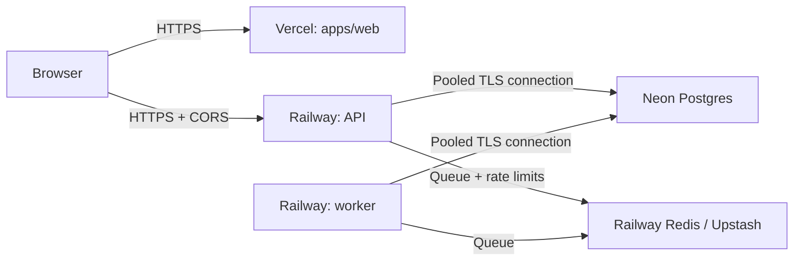

# Production hardening and deployment

## Target architecture



The API uses Helmet security headers, an explicit CORS origin allowlist, and a global
limit of 100 requests per minute per IP address. Registration and login share a stricter
limit of 5 attempts per 15 minutes per IP address; token refresh has a limit of 30 attempts
per 15 minutes per IP address. Health endpoints are not rate-limited so that health checks
cannot accidentally mark a healthy instance as unavailable.

Setting `RATE_LIMIT_REDIS_URL` on the API enables a shared rate-limit store. It is required
when running more than one API replica, because the in-memory store is valid only for a
single instance. Redis is already required by BullMQ, so the simplest option is to use one
Redis instance for both queues and rate limiting, with separate key namespaces.

Swagger UI is public at `https://<api-host>/docs/`, with the OpenAPI specification available
at `/docs/json` and `/docs/yaml`. Swagger recognizes the Zod schemas; a Bearer token can be
pasted into the UI to test protected endpoints.

## API environment variables

`apps/api/src/config/env.ts` validates all variables at startup. An invalid value stops the
process before it starts listening on a port.

| Variable                                            | Railway API                                             | Railway worker |
| --------------------------------------------------- | ------------------------------------------------------- | -------------- |
| `DATABASE_URL`                                      | Pooled Neon connection string with `sslmode=require`    | Same URL       |
| `NODE_ENV`                                          | `production`                                            | `production`   |
| `HOST`                                              | `0.0.0.0`                                               | —              |
| `TRUST_PROXY`                                       | `true`                                                  | —              |
| `CORS_ORIGIN`                                       | Exact Vercel URL, e.g. `https://job-tracker.vercel.app` | —              |
| `JWT_SECRET`                                        | A unique random secret, at least 32 characters          | —              |
| `COOKIE_SECURE`                                     | `true`                                                  | —              |
| `COOKIE_SAME_SITE`                                  | `none` for `vercel.app` + `railway.app` domains         | —              |
| `RATE_LIMIT_MAX` / `RATE_LIMIT_WINDOW_MS`           | `100` / `60000`                                         | —              |
| `AUTH_RATE_LIMIT_MAX` / `AUTH_RATE_LIMIT_WINDOW_MS` | `5` / `900000`                                          | —              |
| `REDIS_URL`                                         | Reference to the Redis service                          | Same reference |
| `RATE_LIMIT_REDIS_URL`                              | Same value as `REDIS_URL`                               | —              |

Generate a secret in PowerShell with:

```powershell
[Convert]::ToBase64String((1..48 | ForEach-Object { Get-Random -Maximum 256 }))
```

Do not set `PORT` manually on Railway; the platform injects it automatically. See
`apps/api/.env.example` for the local environment template.

## 1. Neon

1. Create a project and a production branch in a region as close to Railway as possible.
2. In **Connect**, copy the pooled connection string (the host contains `-pooler`) and keep
   the `sslmode=require` parameter.
3. Set this connection string as `DATABASE_URL` in both Railway services.

Using the pooled URL limits the number of open connections from the API and worker.
Migrations run before the API deployment with `prisma migrate deploy`, never with
`prisma migrate dev`.

## 2. Railway: Redis, API, and worker

1. Create a Railway project and add Redis, or connect an Upstash instance. Keep its
   `REDIS_URL`.
2. Add an **API** service from this repository. Under **Config as Code**, select
   `/railway.api.json`; it selects the Dockerfile, runs migrations before deployment, and
   checks `/readyz`.
3. Add a separate **worker** service from the same repository. Select
   `/railway.worker.json`. The worker uses the same image but runs only
   `node dist/worker.js`, so it does not expose a public port or run migrations concurrently
   with the API.
4. Set `DATABASE_URL` and `REDIS_URL` on both services. On the API, additionally set
   `RATE_LIMIT_REDIS_URL` to the same Redis reference and configure the remaining values
   from the table above.
5. On the API service, choose **Generate Domain** and note the resulting URL, for example
   `https://api-name.up.railway.app`.

The Railway pre-deploy command has access to secrets and stops the deployment if a migration
fails. `prisma` is intentionally a production dependency so that this command is available
in the built image.

## 3. Vercel

1. Import the repository as a new project, set **Root Directory** to `apps/web`, and enable
   access to files outside that directory because `packages/shared` is a workspace dependency.
2. Add the only production environment variable:

   ```text
   NEXT_PUBLIC_API_URL=https://api-name.up.railway.app/api/v1
   ```

   This value is included in the browser bundle, so it must not contain a secret.

3. Deploy the project, then set the resulting Vercel URL as `CORS_ORIGIN` on the Railway API
   and redeploy the API. Only then will the browser pass the preflight request and send the
   cookie.

The CORS allowlist does not permit a wildcard when `credentials: true` is enabled. During a
temporary domain migration, both exact origins may be supplied as a comma-separated list.

## Important: cookies and a custom domain

`*.vercel.app` and `*.railway.app` are different sites. For platform domains, set
`COOKIE_SECURE=true` and `COOKIE_SAME_SITE=none`; some browsers or privacy settings may still
block this cookie as a third-party cookie.

The preferred production setup uses a custom domain: `app.example.com` on Vercel and
`api.example.com` on Railway. They are then same-site, so `COOKIE_SAME_SITE=lax` can be used
while `CORS_ORIGIN` remains exactly `https://app.example.com`. This removes the dependency on
third-party cookie support.

## Post-deployment verification

```powershell
curl.exe -i https://api-name.up.railway.app/healthz
curl.exe -i https://api-name.up.railway.app/readyz
curl.exe -i https://api-name.up.railway.app/docs/
curl.exe https://api-name.up.railway.app/docs/json
```

Confirm that `/healthz` and `/readyz` return 200, `/docs/` is public, and responses include
`Content-Security-Policy` and `X-Content-Type-Options: nosniff`. Verify that logging in from
Vercel works without CORS errors. Railway logs must not contain passwords, tokens, or
`set-cookie` values; the Pino configuration redacts them.
